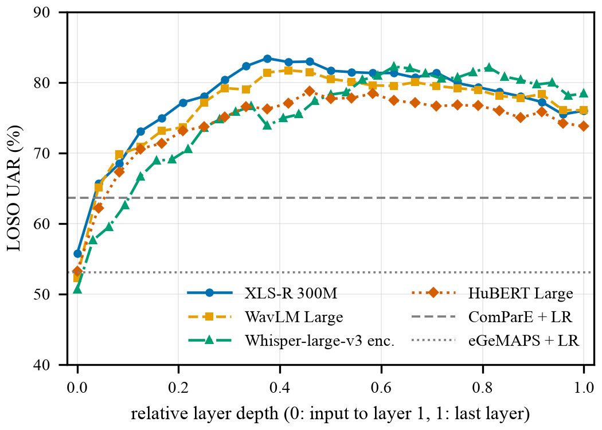

# Speaker-Independent Speech Emotion Recognition on RAVDESS

[](https://github.com/hsn07pk/ravdess-speaker-independent-ser/actions/workflows/ci.yml)
[](LICENSE)
[](pyproject.toml)
[](report/report.pdf)

How well does speech emotion recognition work for a speaker the model has never heard? This repository compares handcrafted acoustic features with frozen speech foundation models on the speech part of RAVDESS under one strict protocol: leave-one-speaker-out over all 24 actors, with the layer and the regularization chosen inside the training folds only. It also fine-tunes WavLM end to end, measures how much common protocol shortcuts inflate the results, checks a public emotion model for training-data contamination, and compares the models with the human listeners of RAVDESS clip by clip.

It contains the code, the out-of-fold predictions of every system, the run logs and the LaTeX source of the research report for the course Affective Computing (521285S), University of Oulu, autumn 2026. Report: [report/report.pdf](report/report.pdf).

## Results

| System (LOSO over 24 actors, 8 emotions) | UAR % [95% CI] | Acc % | Macro-F1 % |
|---|---|---|---|
| XLS-R 300M, frozen, linear probe | 81.9 [77.8, 85.9] | 81.7 | 81.4 |
| WavLM-L, frozen, linear probe | 81.3 [77.1, 85.2] | 81.2 | 81.0 |
| Whisper-L-v3 encoder, frozen, linear probe | 80.2 [75.8, 84.3] | 80.3 | 79.7 |
| HuBERT-L, frozen, linear probe | 77.8 [72.5, 82.6] | 77.6 | 77.4 |
| WavLM-L fine-tuned end to end | 73.2 [66.5, 79.0] | 72.4 | 72.0 |
| emotion2vec base, frozen, linear probe | 66.7 [62.3, 70.8] | 66.3 | 66.2 |
| ComParE 2016 (6373), linear probe | 63.6 [59.0, 68.4] | 63.4 | 62.8 |
| eGeMAPS v02 (88), linear probe | 53.1 [49.5, 56.4] | 52.7 | 52.1 |
| librosa MFCC + prosody (pYIN) + spectral (113), linear probe | 50.5 [45.6, 55.5] | 50.8 | 49.7 |
| Labels permuted within each actor (WavLM-L, 3 seeds) | 13.4 | | |
| Chance | 12.5 | | |

- Frozen foundation models with a linear probe reach 77.8 to 81.9% UAR, 14.2 to 18.3 points above the best handcrafted set (ComParE, 63.6%; Holm-corrected p at most 0.0014); the differences among the four models are not significant.
- The selected layers lie in the middle of the wav2vec 2.0-type models (layers 8 to 15 of 24) and in the upper middle of the Whisper encoder (20 to 26 of 32); a last-layer probe loses up to 5.9 points.
- Fine-tuning WavLM-L end to end with one fixed recipe gives 73.2% UAR, 8.1 points below its frozen probe (worse for 18 of the 24 actors, Wilcoxon p = 2.9e-04).
- Protocol shortcuts inflate the same pipeline: a random 5-fold split adds 7.2 to 13.4 points, per-speaker normalization 4.9 to 9.3, and picking the layer on the test results up to 2.0.
- emotion2vec+ large, whose training data include RAVDESS, reaches 79.9% accuracy on seven options without any training here, so it is reported only as contaminated.
- On the seven options of the RAVDESS listening test the frozen models are right on 79.6 to 83.6% of the clips, against 62.4% for the average listener, and they find the same clips hard (Spearman rho 0.42 to 0.49 between per-clip listener accuracy and the model's probability of the true emotion).

<p align="center">
  
</p>

Every table behind these numbers is in [results/](results) (file guide in [results/README.md](results/README.md)); the full analysis is in the [report](report/report.pdf).

## Method

- **Data**: RAVDESS speech, audio only: 1440 clips from 24 professional actors (12 female, 12 male), 8 emotions. Leading and trailing silence is trimmed.
- **Representations**: MFCC + prosody (pYIN) + spectral statistics (librosa, 113 dimensions), eGeMAPS v02 (88) and ComParE 2016 (6373) from openSMILE; frozen WavLM Large, HuBERT Large, XLS-R 300M and the Whisper large-v3 encoder, every hidden layer mean-pooled over time; emotion2vec base and emotion2vec+ large.
- **Classifiers**: logistic regression as the main probe, RBF SVM and random forest; scaling is fit on the training actors only.
- **Protocol**: leave-one-speaker-out over the 24 actors. Inside each outer fold, 5-fold GroupKFold over the 23 training actors picks the (layer, C) pair, and the model is refit on all 23 actors.
- **Statistics**: UAR as the main metric, with accuracy and macro-F1; 95% intervals from an actor-level bootstrap (10,000 resamples); paired Wilcoxon tests over the 24 actors, Holm-corrected over 23 comparisons; a label-permutation check with the full nested selection.
- **Fine-tuning**: WavLM Large end to end on the CSC Roihu supercomputer, one NVIDIA GH200 per fold, 1.26 GPU hours for all 24 folds.
- **Further analyses**: random-split, per-speaker-normalization and test-set layer-selection variants of the same pipeline; the EmoBox 6-fold split as a sanity anchor; a zero-shot check of emotion2vec+; per-clip comparison with the listener ratings released with RAVDESS.

## Repository layout

```
src/ser/     features, nested LOSO probe, evaluation, analysis and figures
scripts/     data download, feature extraction, evaluation, CSC Roihu job
data/        listener ratings (RAVDESS S1 to S4); the audio goes here
features/    clip metadata (meta.csv) and timings; embeddings are not tracked
results/     summary tables and every out-of-fold prediction
figures/     figures of the report, PDF and PNG
logs/        output of every step, environments, Slurm logs
report/      LaTeX source and PDF of the report
tests/       unit tests of the evaluation code
```

## Recompute the tables without the audio

The summary tables, confidence intervals and paired tests are computed from the saved out-of-fold predictions, so no audio or GPU is needed:

```bash
git clone https://github.com/hsn07pk/ravdess-speaker-independent-ser.git
cd ravdess-speaker-independent-ser
python3.11 -m venv .venv && source .venv/bin/activate
pip install -r requirements.txt -e ".[dev]"
make analysis   # results/*.csv from results/predictions/
make test       # unit tests
```

## Full reproduction

1. Environments: `conda env create -f environment.yml` for everything except emotion2vec, and `conda env create -f environment-e2v.yml` for emotion2vec (funasr).
2. Data: `make data` downloads RAVDESS from Zenodo (record 1188976, md5 checked) into `data/RAVDESS_speech`. To use an existing copy, set `RAVDESS_DIR`.
3. `make features PY_E2V=<python of the e2v env>`: handcrafted features and frozen embeddings, about 1.4 GB (about one hour on an Apple M5 Pro).
4. `make evaluate`: every LOSO run from the features (about one hour on 15 CPU cores).
5. `make analysis sensitivity figures`: tables, tests, sensitivity runs and figures.
6. `make report`: `report/report.pdf`.

The fine-tuning job is in [scripts/roihu](scripts/roihu); its per-fold outputs are in `results/finetune/` and its Slurm logs in `logs/finetune/`.

## Data and licenses

- Code: [MIT](LICENSE).
- RAVDESS (Livingstone and Russo, 2018) is licensed CC BY-NC-SA 4.0 and is not redistributed here; download it from [Zenodo](https://zenodo.org/records/1188976).
- `data/human_ratings/` holds the S1 to S4 tables of the RAVDESS paper ([PLoS ONE 13(5): e0196391](https://doi.org/10.1371/journal.pone.0196391)), CC BY 4.0.
- The EmoBox folds are the released RAVDESS split of [EmoBox](https://github.com/emo-box/EmoBox) (commit 39c306b), listed in `src/ser/run_eval.py`.

## Citation

If you use this code or these results, please cite them with the metadata in [CITATION.cff](CITATION.cff) (GitHub: "Cite this repository").

## Acknowledgments

Computing time on the Roihu supercomputer was provided by CSC, IT Center for Science, Finland.
